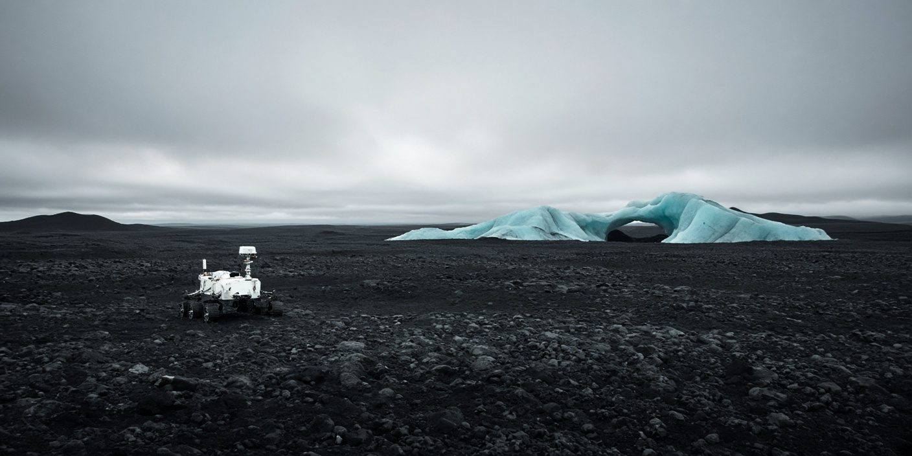

# Showcase notes

[Back to the README](../README.md)

## Made with this CLI

The README cover is an actual Grok Imagine result generated on September 28,
2026 with `grok-api 0.1.1`, using an existing official Grok CLI login.
The image model was explicitly set to `grok-imagine-image-2.0`.

From the repository root, after authenticating:

```bash
mkdir -p docs/assets
grok-api image generate \
  --prompt 'Cinematic photograph of a solitary small white research rover on an immense black volcanic plain, a sharp turquoise glacial arch in the distance, pale overcast sky, minimalist composition, tactile natural textures, cool cyan and charcoal palette, panoramic wide shot, no text, no logos' \
  --aspect-ratio 2:1 \
  --model grok-imagine-image-2.0 \
  --resolution 1k \
  --out docs/assets/imagine-rover.jpg
```

The returned image was 1408 × 704 pixels. The committed JPEG is recompressed
at quality 82 with progressive encoding and metadata removed. Its composition
is unchanged; there is no added lettering or compositing. Generation is
nondeterministic, so rerunning the same prompt will produce a different image.
Access and usage charges depend on your account and the upstream service.



The README's shorter rover prompt is a starting point for your own image.
Its video commands demonstrate the CLI syntax; they are not claims that a
video was generated or tested against the live service for this showcase.

## Visual direction

A quiet, cinematic landscape pairs charcoal terrain with cyan ice. The image
demonstrates the tool's output; the surrounding native GitHub typography keeps
installation and commands readable. Three useful badges and a compact jump
menu precede the image. Platform-specific installation leads into a short
authenticate → generate → customize sequence, then the complete command guide.

The cover has no embedded text. All instructions remain selectable, and its
alt text describes the scene. A single opaque JPEG works against both GitHub
themes; native Markdown controls text colors and mobile layout. No custom CSS,
animation, external font, or theme-specific image is required.

## README references

These GitHub READMEs were browsed while designing this update:

| Reference | What informed this README |
| --- | --- |
| [Charmbracelet VHS](https://github.com/charmbracelet/vhs#readme) | Put the tool's output near the top and connect the demonstration to its source command. |
| [Replicate CLI](https://github.com/replicate/cli#readme) | Explain authentication before generation and keep examples centered on concrete tasks. |
| [yt-dlp](https://github.com/yt-dlp/yt-dlp#readme) | Make installation and detailed command documentation easy to reach through clear navigation. |

The artwork and layout here were created for grok-api; no reference artwork
or branding was copied.
